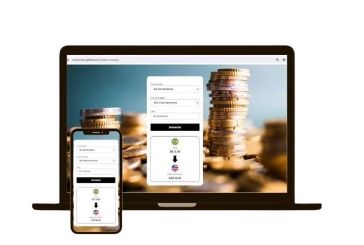

# Convert Money

Convert Money é a solução perfeita para suas necessidades de conversão de moeda, oferecendo uma experiência fácil e eficiente. Com a rapidez de um toque, você pode converter valores monetários entre diferentes moedas com precisão e atualizações em tempo real das taxas de câmbio.

## Tech-Stack-

 

## Descrição-

- Conversão Instantânea:

- Converta valores monetários instantaneamente, sem complicações. Basta inserir o montante e selecionar as moedas desejadas.
Taxas de Câmbio em Tempo Real:

- Mantenha-se atualizado com as taxas de câmbio mais recentes. O ConvertMoney fornece informações em tempo real para garantir que você tenha dados precisos ao realizar suas conversões.
Suporte a Diversas Moedas:

- Converta entre uma ampla variedade de moedas globais. O aplicativo suporta uma extensa lista de opções, permitindo que você converta facilmente entre diferentes unidades monetárias.

-Interface Intuitiva e Amigável:
O design intuitivo do aplicativo torna a navegação fácil para usuários de todos os níveis. A interface amigável proporciona uma experiência agradável durante a utilização.

Você pode visualizar o layout do projeto através [DESSE LINK]( https://williamnani.github.io/Convert-money/).
